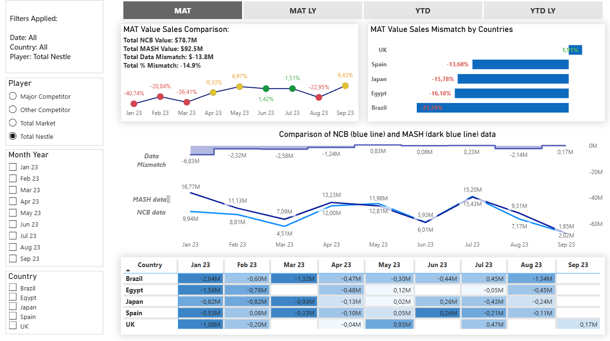
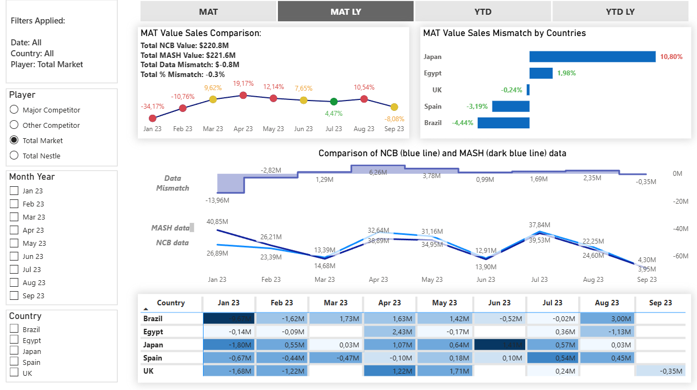

# 📊 Sales Data Mismatch Analysis: MASH vs NCB

## 📌 Project Overview
Which numbers do you trust when two systems show conflicting sales figures? 

In this Power BI project, I tackled a common but critical business challenge: **Data Mismatch**. When data from multiple sources doesn't align, stakeholders lose confidence. I built an interactive tool to make these discrepancies transparent and easy to analyze.

> **Note:** The full interactive dashboard is available in the `.pbix` file included in this repository. Below is a demonstration of its core functionality.

## 🎯 The Business Value
This dashboard compares Value Sales across two databases (NCB and MASH). Instead of manual Excel checks, management can instantly pinpoint where the numbers drop off—identifying the exact country, month, or market player causing the issue.

---

## 💻 Dashboard Preview

---

## ⚙️ Technical Highlights
Building this required robust data architecture and advanced DAX formulation:

* **Dynamic Time Intelligence:** Created custom DAX measures using `VAR` to seamlessly switch between MAT, MAT LY, YTD, and YTD LY periods via a single custom slicer. This eliminates the need for redundant charts.
* **Robust Data Modeling:** Built strong relationships between multiple fact tables (for both data sources) and dimension tables, including a comprehensive custom Calendar table for precise chronological sorting.
* **Conditional Formatting:** Integrated automated color-coded indicators (🔴 >10% variance, 🟡 5-10%, 🟢 <5%) to instantly highlight critical data gaps across line charts and matrix visuals.

## 📁 Repository Contents
* `Advanced_coffee_dataset_analysis.pbix` - The complete Power BI project file.

## 🚀 How to Use
To interact with the dashboard:
1. Download the `.pbix` file from this repository.
2. Open it using Power BI Desktop.
3. Use the **Periods Slicer** at the top to toggle between MAT, YTD, and other timeframes to see the dynamic recalculations in action.
